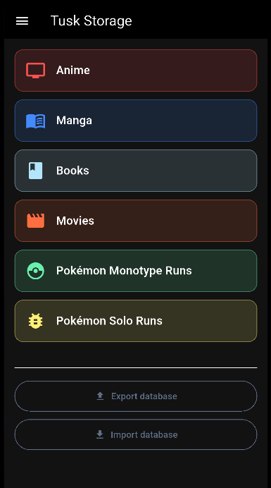
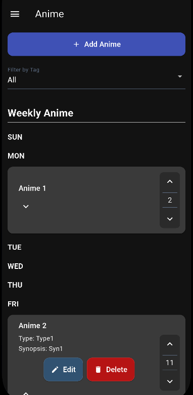
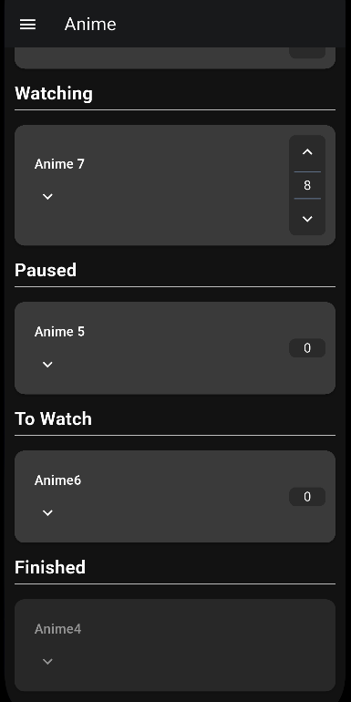
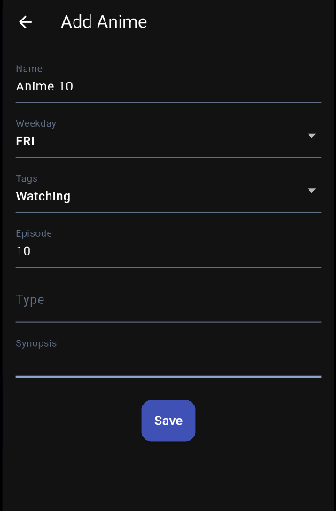
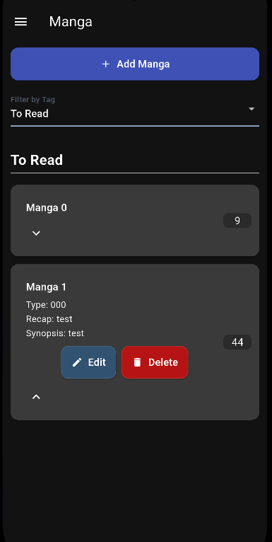
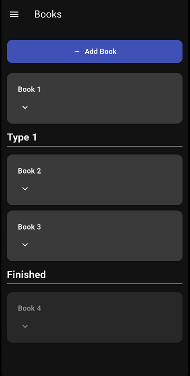
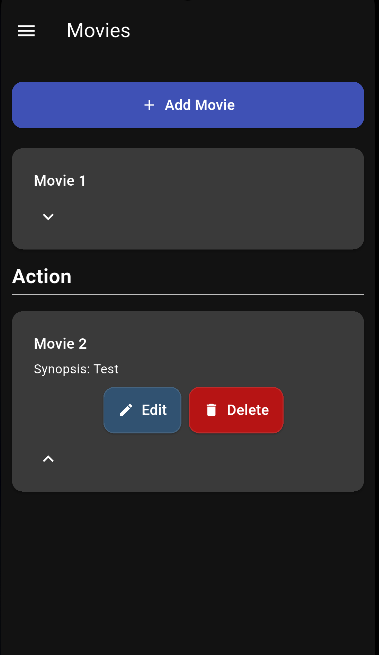
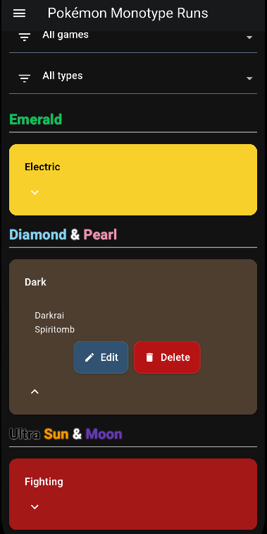
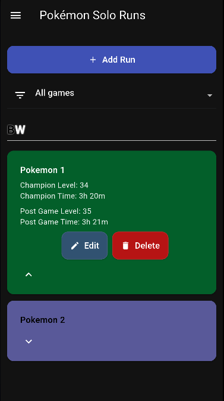

# Tusk Storage

Local storage app for making lists and keeping information (animes, mangas, movies, books, and pokémon runs)

## Features

Track anime episodes and manga chapter

Organize items by tags

Weekly release schedule

List books and movies

Organize Pokémon Monotype or Solo runs

Expandable cards for more information

Importation and exportation of the data

## Items information

### Animes and Mangas

Contain name, chapter/ep, weekday, tag, recap (manga only), type, and synopsis

Tags are Releasing, Reading/Watching, Paused, To Read/Watch, Finished, and Hiatus (manga only)

Can select items from only a certain tag to appear, to find the items easier

Releasing and Reading/Watching items can have the chapter/ep easily changed
with a button on the right side

Weekly section only for mangas/animes that are releasing

### Books and Movies

Contain name, type, synopsis, and tag (only book)

Books have the tags To Read and Finished tags (in case the series is still releasing)

The type isn't restricted, you can create the types in the book/movie creation and
and filter by it afterwards

### Pokémon Runs

Monotype Runs contain the game, the type and a list of the pokemon used

Solo Runs contain the game, the pokémon name, the champion level and time,
the post game level and time, the card color (to look like the pokémon), the text color,
and a extra

The Champion Time is only shown if there is a Champion Level. Same for the post game

The color of the cards in the monotype runs are made to remember each pokémon type

The Runs are divided by the games, with each game title made to remember the game

The monotype runs can also be filtered by the type

## Screenshots

  
  
  

  
  
  

  
  
  

